#1. Clientes ligeros con LTSP
Esta práctica consiste en configurar un LTSP, Linux Terminal Server Project,que son un conjunto de servidores que proporcionan la capacidad de ejecutar Linux en ordenadores de pocas prestaciones de velocidad o de bajo coste. Con esto se permite reutilizar equipos que se encuentran obsoletos.

#2. Máquina Servidor
Empezamos con la máquina servidor, donde tendremos que configurar la imagen que los clientes usaran para el sistema operativo.
 

##2.1 Preparar Server
El servidor tendrá dos interfaces o adaptadores de red, uno apuntando hacia los clientes ligeros y otro hacia la conexión a internet, ya que tendrá que dar IPs a dichos clientes.
A continuación vemos la configuración de ambas interfaces. Adaptador 1 en modo puente, corresponde con la interfaz eth0.
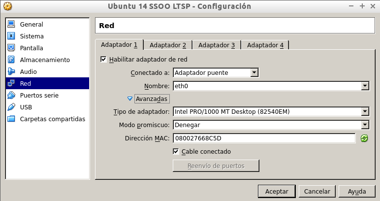  
Adaptador 2 en modo red interna.
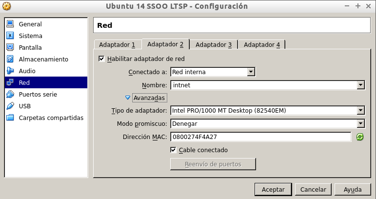  
Una vez encendida la máquina virtual procedemos a configurar las conexiones de red.
La siguiente imagen muestra como configuré la conexión puente, con una IP dentro del rango de la red de clase para acceder a internet.

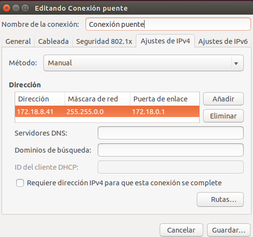

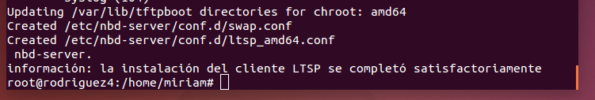
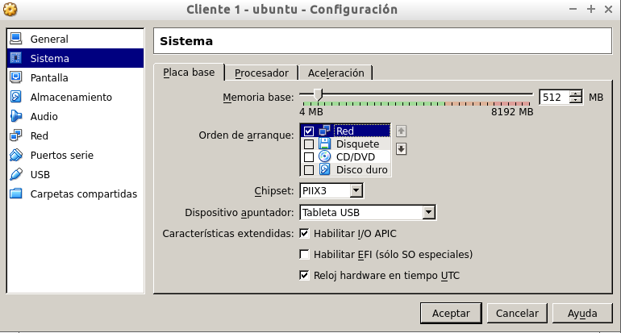
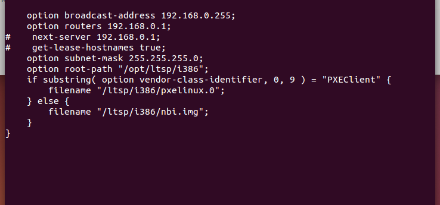
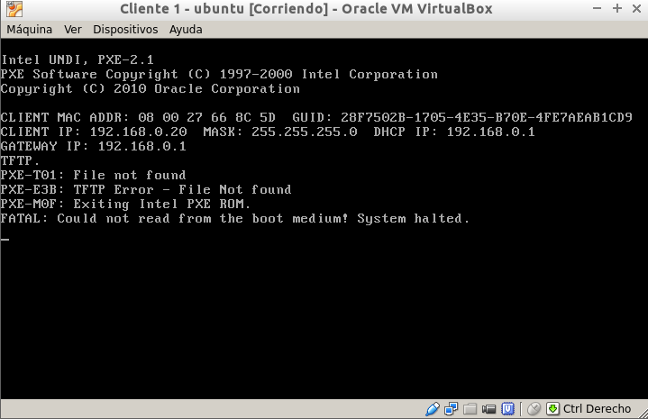
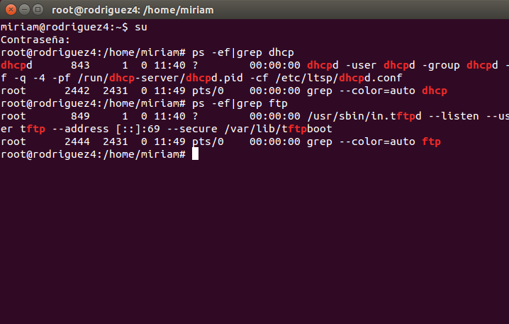
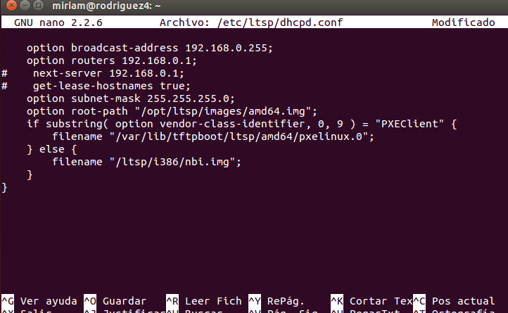
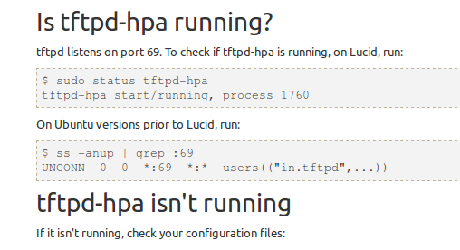
##2.2 Configurar Server
Lo siguiente es ejecutar ciertos comandos para comprobar la salida de todos ellos.  
En esta primera imagen ejecutamos *ip a* para ver las interfaces.  
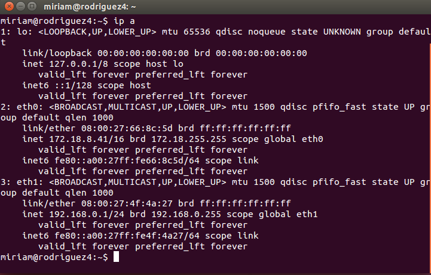  
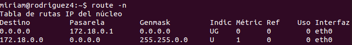
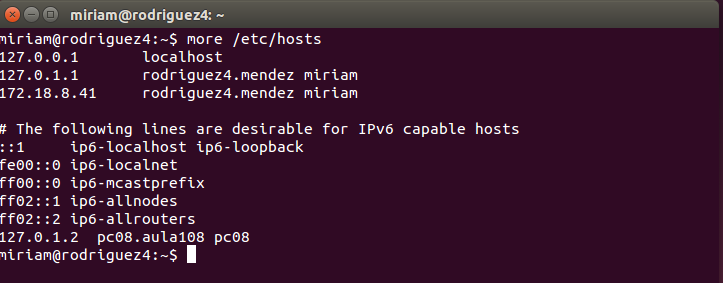  
Creamos tres usuarios.  
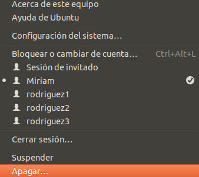
##2.3 Instalar servicio LTSP
Pasamos a instalar el servicio LTSP.
#3. Máquinas clientes

