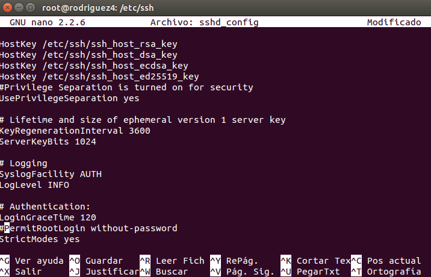
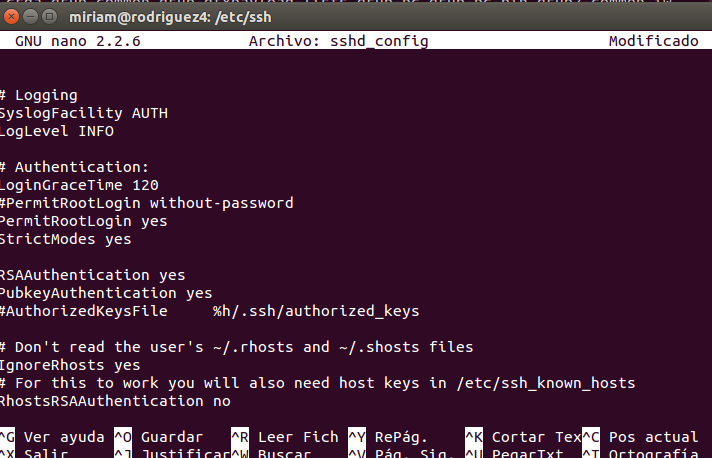

#1. Clientes ligeros con LTSP
Esta práctica consiste en configurar un LTSP, Linux Terminal Server Project,que son un conjunto de servidores que proporcionan la capacidad de ejecutar Linux en ordenadores de pocas prestaciones de velocidad o de bajo coste. Con esto se permite reutilizar equipos que se encuentran obsoletos.

#2. Máquina Servidor
Empezamos con la máquina servidor, donde tendremos que configurar la imagen que los clientes usaran para el sistema operativo.

##2.1 Preparar Server
El servidor tendrá dos interfaces o adaptadores de red, uno apuntando hacia los clientes ligeros y otro hacia la conexión a internet, ya que tendrá que dar IPs a dichos clientes.

##2.2 Configurar Server

##2.3 Instalar servicio LTSP

#3. Máquinas clientes

