# 1. Introducción
En esta práctica vamos a trabajar con el servicio SSH, este servicio es un protocolo, y sirve para acceder a máquinas remotas a través de una red. 
Para esta práctica necesitaremos las siguientes 3 MVs:

- Un servidor GNU/Linux OpenSUSE, con IP estática (172.18.8.53).
- Un cliente GNU/Linux OpenSUSE, con IP estática (172.18.8.54).
- Un cliente Windows7, con IP estática (172.18.8.13).

# 2. Configurar máquinas
Comenzamos preparando las diferentes interfaces de red en las máquinas. Para configurar la red en OpenSuse usaremos el interfaz gráfico 'yast':
## 2.1. Servidor SSH
Introducimos la IP de nuestro server:

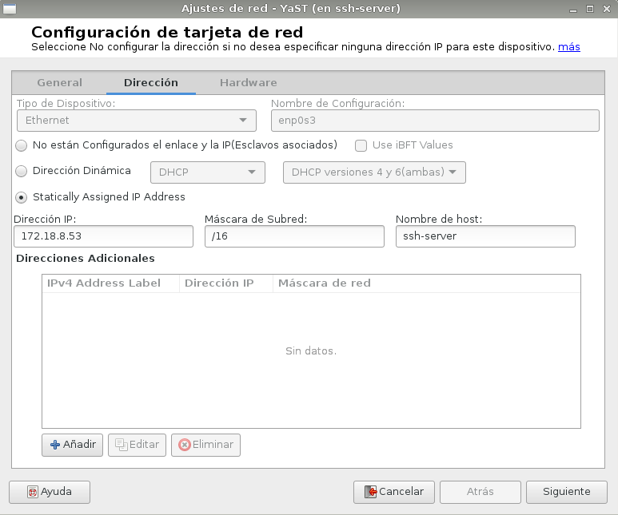

Nuestro nombre de host y de equipo, también DNS:

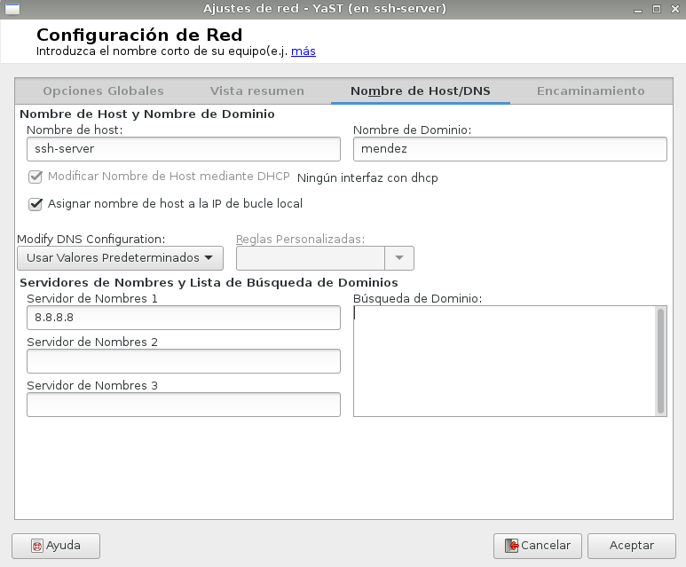

Por último, nuestra puerta de enlace:

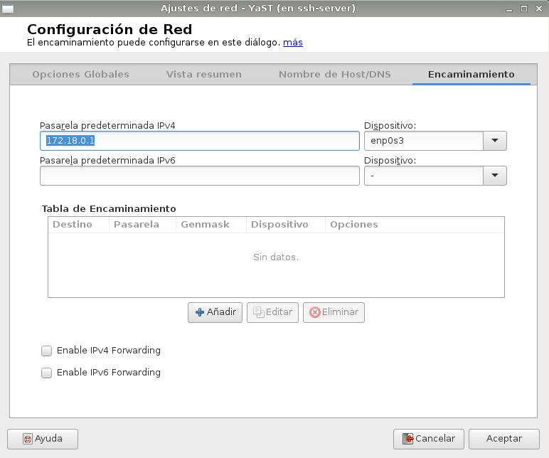

Ejecutamos los siguientes comandos para verificar que hemos configurado los nombres bien:

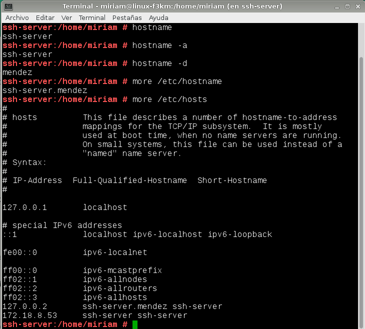

Los siguiente sería crear 4 usuarios en el servidor, utilizaremos nuestro apellido:

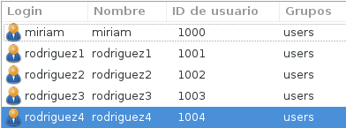

Añadir en /etc/hosts los equipos ssh-client1 y ssh-client2-08 para que puedan comunicarse:

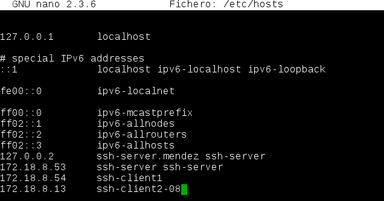

Para comprobar nuevamente los cambios realizados, introducimos los siguientes comandos:

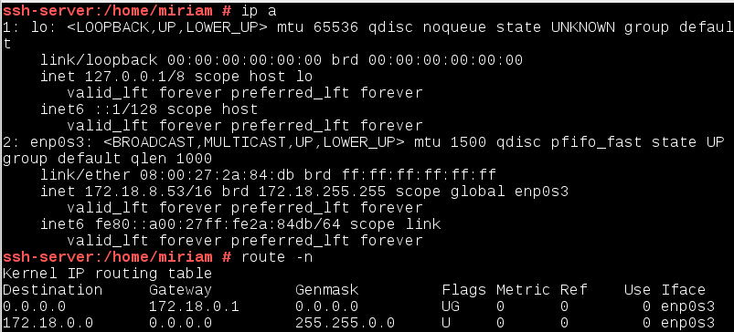

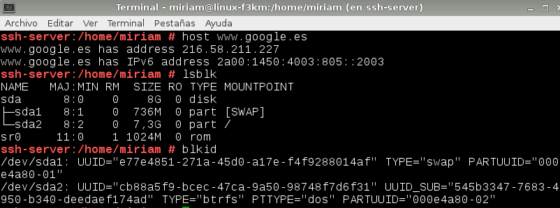

Para comprobar, realizamos un ping entre las tres máquinas y comprobamos la conexión:

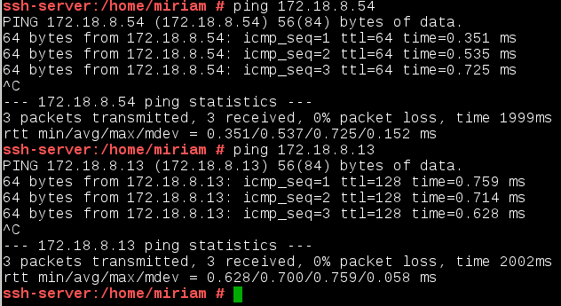

## 2.2. Cliente Opensuse

Configurar el cliente1 con los siguientes valores:

Nombre de equipo ssh-client1, dominio mendez. Configuramos IP.

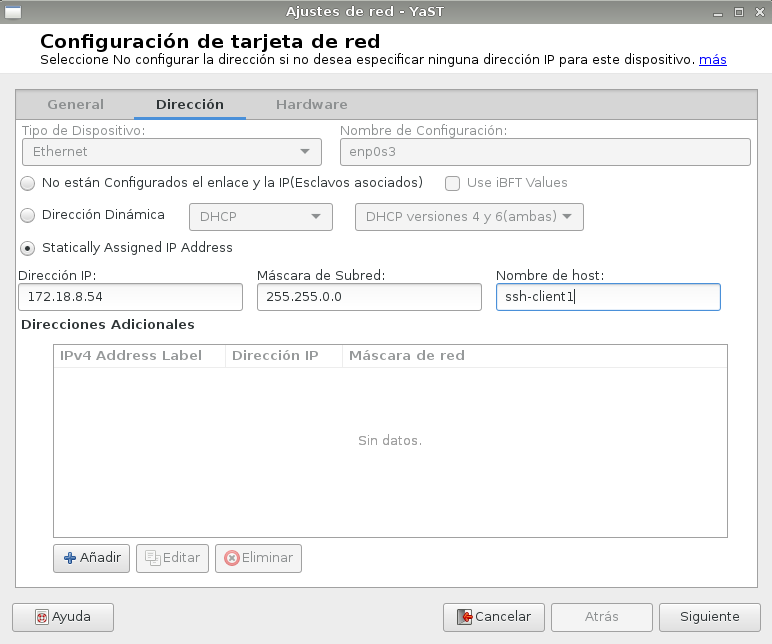

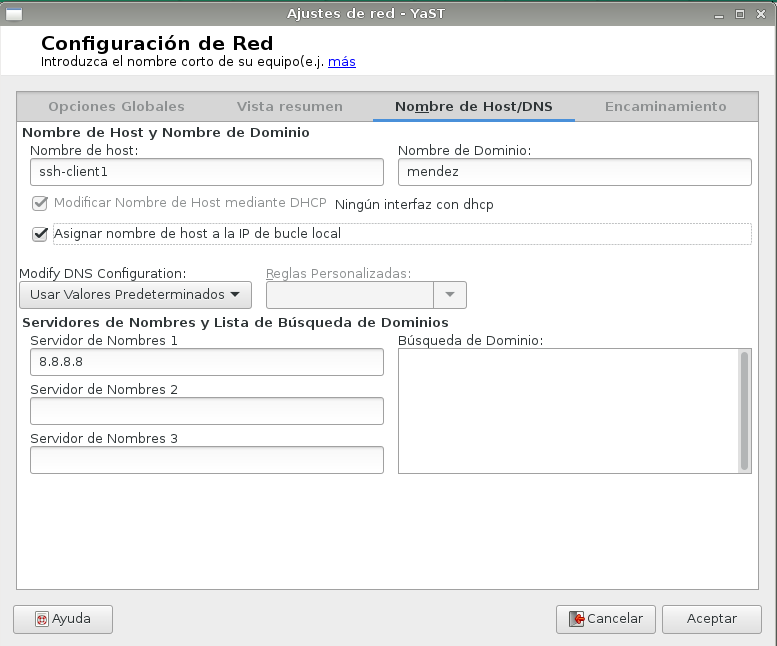

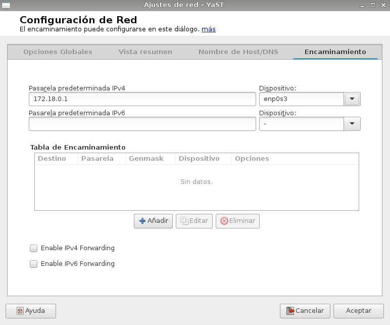

También añadimos el servidor y el cliente windows al fichero /etc/hosts.

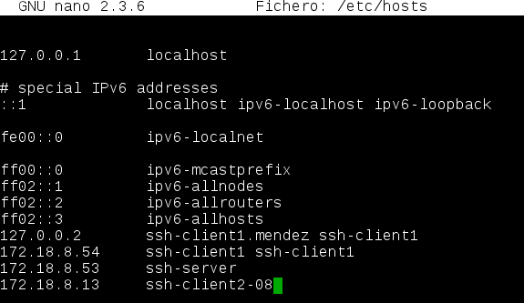

Por último, hacemos ping entre las máquinas para comprobar la conexión.

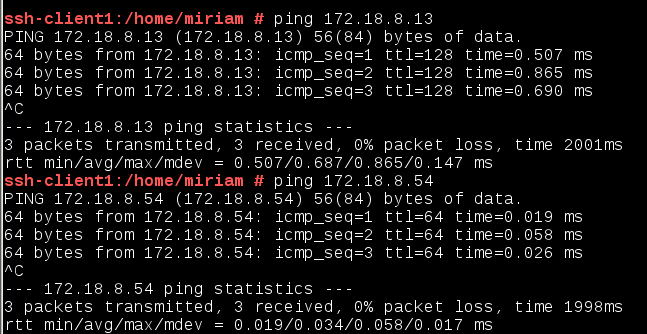

# 2.3. Cliente Windows

En el cliente Windows vamos a descargar PuTTy como cliente ssh. Y configuramos la interfaz de red de la siguiente manera:

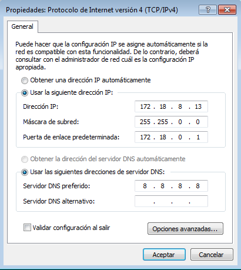

También debemos añadir las otras dos máquinas: cliente linux y servidor al fichero 'hosts'.

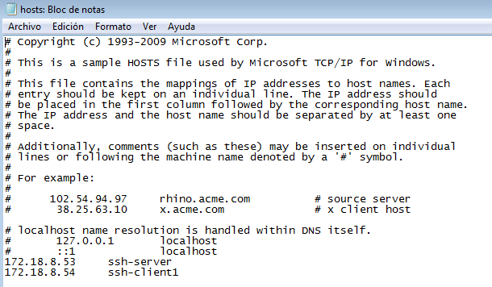

Debemos realizar ping hacia las dos máquinas que añadimos al fichero anterior, para comprobar:

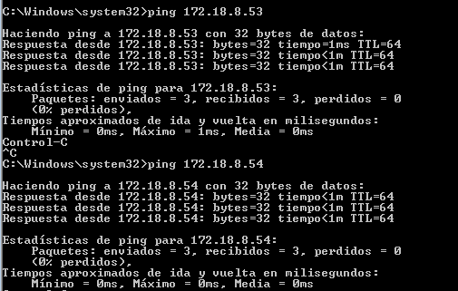

# 3. Instalación servicio SSH

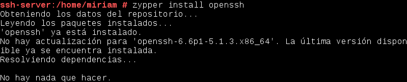

## 3.1. Comprobación

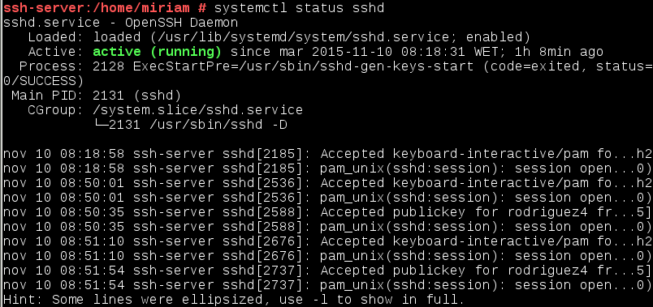

## 3.2. Conexión SSH desde cliente

Debemos comprobar en el servidor la configuración del cortafuegos, y añadir en servicios autorizados el ssh.

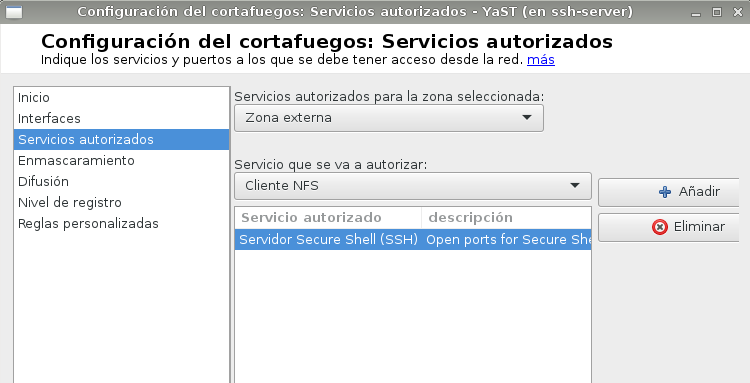

Conexión SSH desde cada cliente usando el usuario rodriguez1, desde ssh-client1:

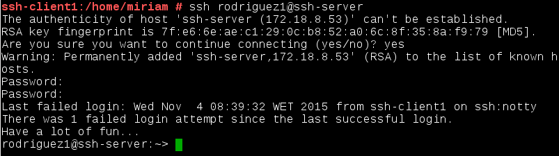

Conexión SSH desde ssh-client2 Windows:

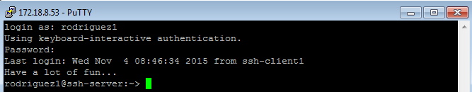

## 3.3. Cambiando claves del servidor

# 4. Personalización prompt Bash

# 5. Autenticación mediante claves públicas

