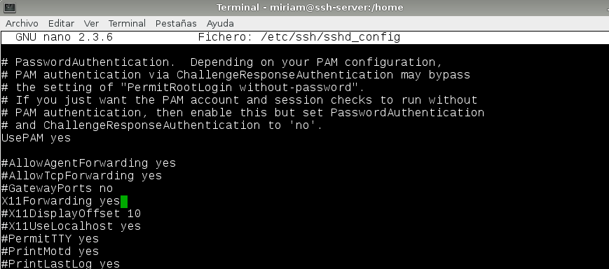

# 1. Introducción
En esta práctica vamos a trabajar con el servicio SSH, este servicio es un protocolo, y sirve para acceder a máquinas remotas a través de una red. 
Para esta práctica necesitaremos las siguientes 3 MVs:

- Un servidor GNU/Linux OpenSUSE, con IP estática (172.18.8.53).
- Un cliente GNU/Linux OpenSUSE, con IP estática (172.18.8.54).
- Un cliente Windows7, con IP estática (172.18.8.13).

# 2. Configurar máquinas
Comenzamos preparando las diferentes interfaces de red en las máquinas. Para configurar la red en OpenSuse usaremos el interfaz gráfico 'yast':
## 2.1. Servidor SSH
Introducimos la IP de nuestro server:

Nuestro nombre de host y de equipo, también DNS:

Por último, nuestra puerta de enlace:

Ejecutamos los siguientes comandos para verificar que hemos configurado los nombres bien:

Los siguiente sería crear 4 usuarios en el servidor, utilizaremos nuestro apellido:

Añadir en /etc/hosts los equipos ssh-client1 y ssh-client2-08 para que puedan comunicarse:

Para comprobar nuevamente los cambios realizados, introducimos los siguientes comandos:

Para comprobar, realizamos un ping entre las tres máquinas y comprobamos la conexión:

## 2.2. Cliente Opensuse

Configurar el cliente1 con los siguientes valores:

Nombre de equipo ssh-client1, dominio mendez. Configuramos IP.

También añadimos el servidor y el cliente windows al fichero /etc/hosts.

Por último, hacemos ping entre las máquinas para comprobar la conexión.

# 2.3. Cliente Windows

En el cliente Windows vamos a descargar PuTTy como cliente ssh. Y configuramos la interfaz de la siguiente manera:

También vamos a añadir las otras dos máquinas: cliente linux y servidor al fichero 'hosts'.

Debemos realizar ping hacia las dos máquinas que añadimos al fichero anterior, para comprobar:

# 3. Instalación servicio SSH

## 3.1. Comprobación

## 3.2. Conexión SSH desde cliente

Debemos comprobar en el servidor la configuración del cortafuegos, y añadir en servicios autorizados el SSH.

Conexión SSH desde cada cliente usando el usuario rodriguez1, desde cliente ssh-client1:

Comprobar contenido del fichero known_hosts en el equipo cliente1:

Conexión SSH desde ssh-client2 Windows:

## 3.3. Cambiando claves del servidor

Modificar el fichero de configuración SSH (/etc/ssh/sshd_config) para dejar una única línea: HostKey /etc/ssh/ssh_host_rsa_key. Comentar el resto de líneas con configuración HostKey. Este parámetro define los ficheros de clave publica/privada que van a identificar a nuestro servidor. Con este cambio decimos que sólo vamos a usar las claves del tipo RSA.

Generamos nuevas claves de equipo en ssh-server, como usuario root ejecutamos lo siguiente:

Con esto conseguimos cambiar o regenerando nuevas claves públicas y privadas para identificar nuestro servidor. Reiniciamos el servicio SSH para que haga efecto este cambio: systemctl restart sshd.

Al intentar conectar desde los clientes nos salta esta alerta:

# 4. Personalización prompt Bash

Ahora vamos a personalizar el prompt Bash para cambiar el color cuando tenemos activa una sesión SSH. Añadimos unas líneas al siguiente fichero:

Además crear el fichero /home/rodriguez1/.alias con el siguiente contenido. Este fichero, como bien dice el nombre, servirá para establecer algunos alias.

Comprobamos que funciona entrando desde un cliente:

# 5. Autenticación mediante claves públicas

El objetivo de este apartado es el de configurar SSH para poder acceder desde el cliente1, usando rodriguez4 sin poner password, pero usando claves pública/privada. Para ello vamos a la máquina cliente1, sin usar root.

Ejecutamos el siguiente comando para generar un nuevo par de claves para el usuario en /home/miriam/.ssh/id_rsa y en /home/miriam/.ssh/id_rsa.pub.

Ahora vamos a copiar la clave pública del usuario de la máquina cliente al fichero 'authorized_keys' del usuario rodriguez4 en el servidor. yo he elegido hacerlo usando un comando específico para ello: 

Comprobamos que podemos acceder remotamente sin introducir ninguna contraseña desde el cliente1.

Vemos que desde el cliente2 sí nos pide password.

# 6. Uso de SSH como túnel para X

Instalar en el servidor una aplicación de entorno gráfico (APP1) que no esté en los clientes, en este caso he elegido Geany.

Debemos modificar en el servidor SSH el fichero /etc/ssh/sshd_config para permitir la ejecución de aplicaciones desde los clientes, opción X11Forwarding.

A continuación, comprobamos desde cliente que podemos ejecutar la aplicación. Vemos que los alias asignados anteriormente siguen funcionando.

