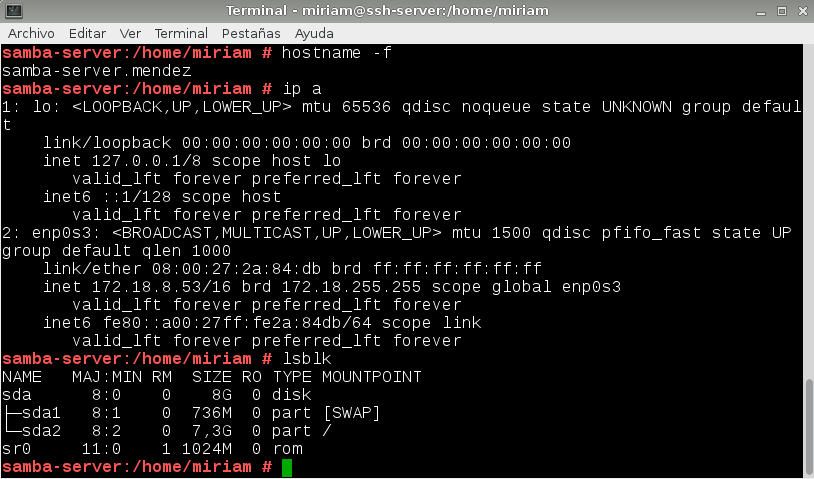
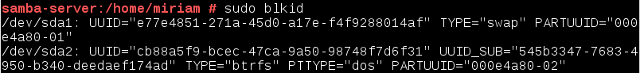
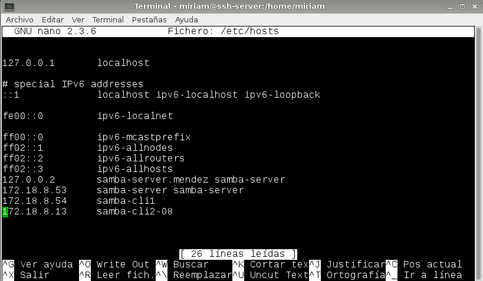
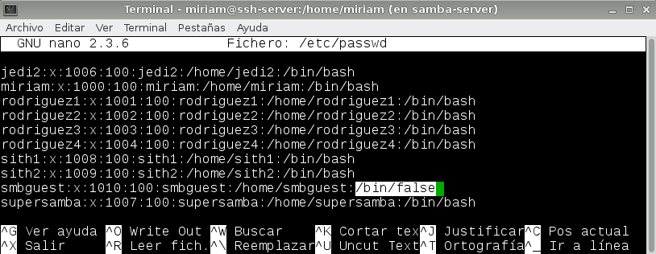
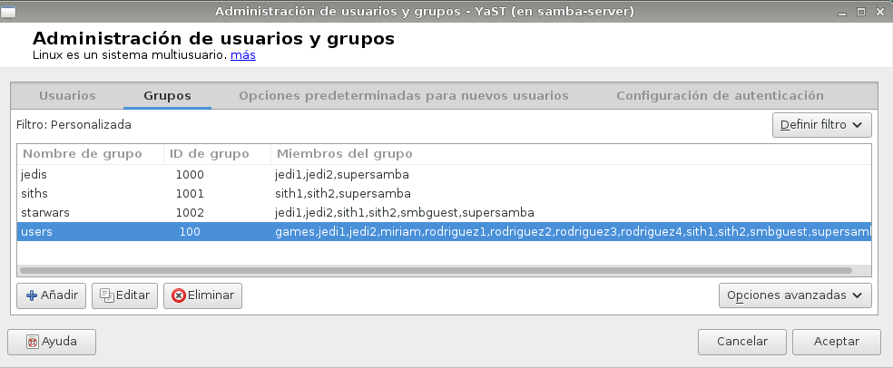
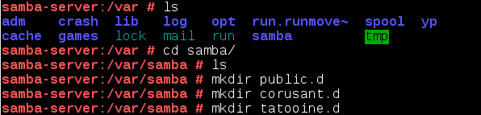
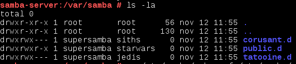

#1. Introducción

Samba son un conjunto de aplicaciones para Linux, que implementan el protocolo de comunicación SMB utilizado por los sistemas operativos Microsoft Windows para compartir carpetas e impresoras. En esta práctica trabajaremos con este programa.

Vamos a necesitar las siguientes 3 MVs:

Un servidor GNU/Linux con IP estática (172.18.8.53).
 
Un cliente GNU/Linux con IP estática (172.18.8.54). 

Un cliente Windows con IP estática (172.18.8.13). 
 
#2. Servidor Samba

##2.1. Preparativos

Capturar salida de los comandos siguientes en el servidor:

##2.2. Usuarios locales

Vamos a GNU/Linux, y creamos los siguientes grupos y usuarios. Podemos usar comandos o entorno gráfico Yast:

* Grupo 'jedis' con 'jedi1', 'jedi2' y 'supersamba'.
* Grupo 'siths' con 'sith1', 'sith2' y 'supersamba'.
* Crear el usuario smbguest. Para asegurarnos que nadie puede usar smbguest para entrar en nuestra máquina mediante login, vamos a modificar en el fichero /etc/passwd de la siguiente manera: "smbguest: x :1001:1001:,,,:/home/smbguest:/bin/false".

* Crear el grupo 'starwars', y dentro de este poner a todos los 'siths', 'jedis', 'supersamba' y a 'smbguest'.

##2.3. Instalar Samba

##2.4. Carpetas para los recursos compartidos

Creamos las carpetas:

Asignamos permisos:

Este es el resultado final:

##2.5. Configurar Samba

##2.6. Usuarios Samba

##2.7. Reiniciar

#3. Windows

##3.1. Cliente Windows GUI

##3.2. Cliente Windows comandos

#4. Cliente Linux

##4.1. GUI

##4.2. Comandos

#5. Montaje automático

#6. Preguntas para resolver

¿Las claves de los usuarios en GNU/Linux deben ser las mismas que las que usa Samba?

¿Puedo definir un usuario en Samba llamado sith3, y que no exista como usuario del sistema?

¿Cómo podemos hacer que los usuarios sith1 y sith2 no puedan acceder al sistema pero sí al samba? (Consultar /etc/passwd)

Añadir el recurso 'homes' al fichero 'smb.conf' según los apuntes. ¿Qué efecto tiene?
