#1. Servidor LDAP - OpenSUSE

En esta práctica vamos a trabajar con LDAP, es un protocolo de tipo cliente-servidor para acceder a un servicio de directorio, esto es, acceder a bases de información de usuarios de una red mediante protocolos TCP/IP. En este caso trabajaremos con distribuciones Linux, concretamente OpenSUSE.

##1.1. Preparativos

Capturar salida de los comandos siguientes en el servidor:

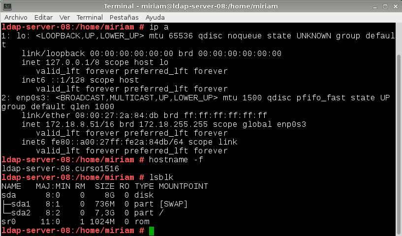

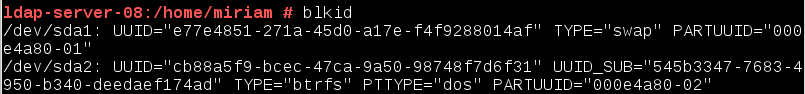

En /etc/hosts añadiremos las siguientes líneas:

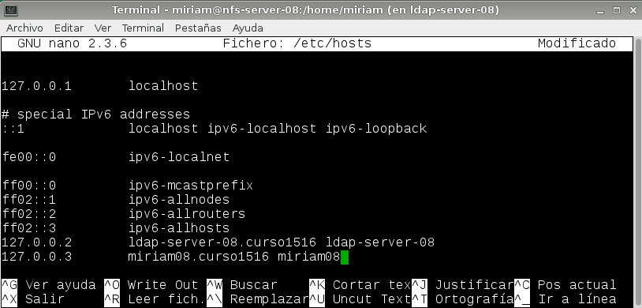

##1.2. Instalación del Servidor LDAP

A continuación, vamos a instalar el servidor LDAP, para ello es necesario abrir Yast y buscar un paquete llamado 'yast2-auth-server'. Una vez instalado pasaremos a configurarlo.

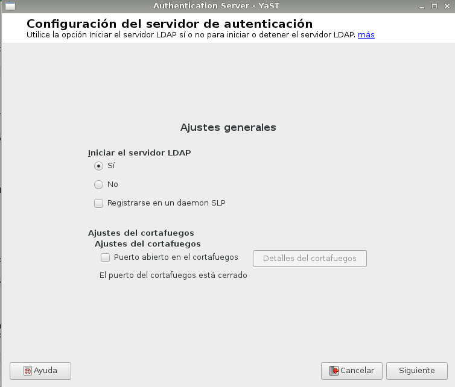

Seleccionamos servidor autónomo.

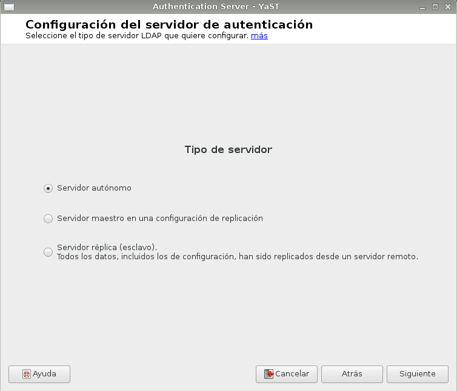

No habilitamos el TLS.

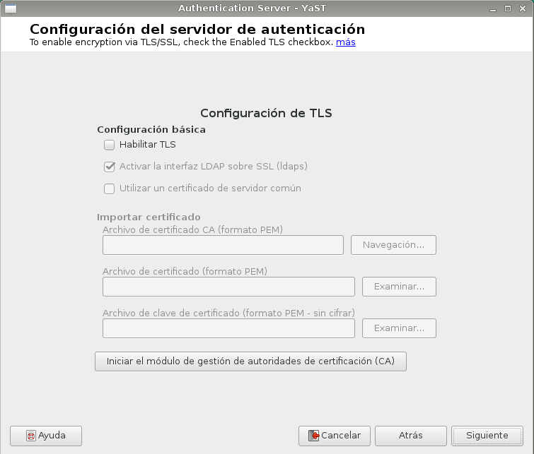

Configuramos la base de datos, dominio, contraseña.

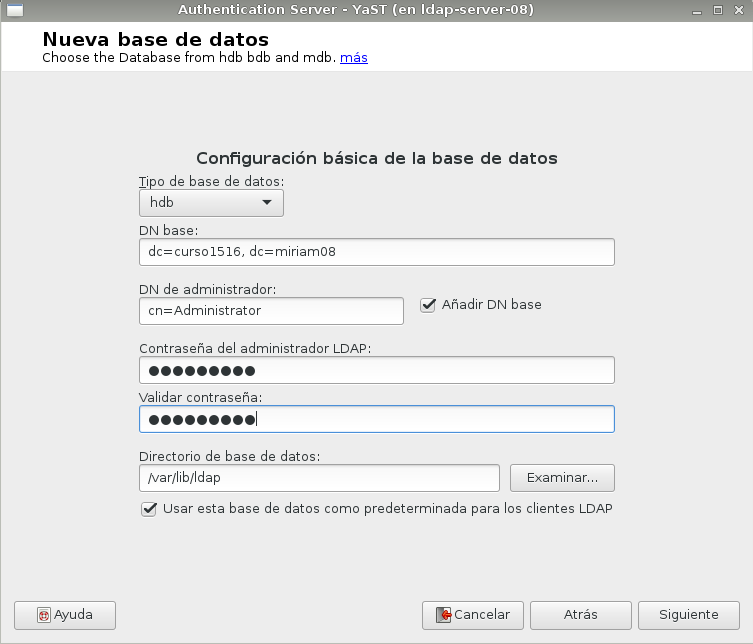

No habilitamos Kerberos, ya que nos dará error más adelante si lo habilitamos.

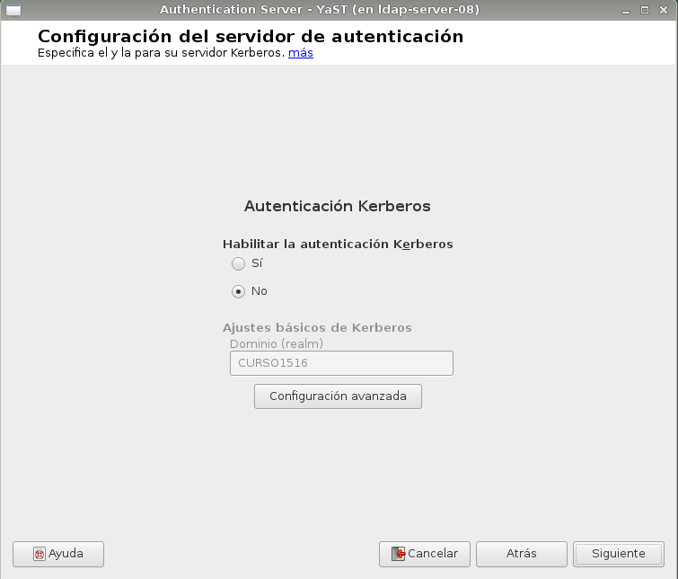

A continuación, vemos la configuración general ya realizada.

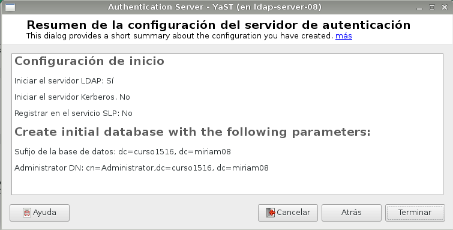

Para comprobar que el servicio está iniciado ejecutamos el comando siguiente:

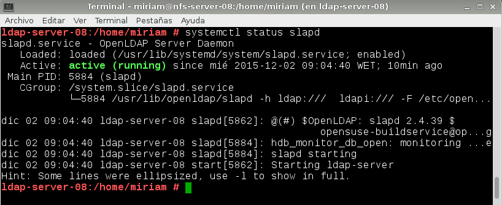

##1.3. Crear usuarios y grupos en LDAP

Entramos en 'Authentication client' para introducir nuestro dominio.

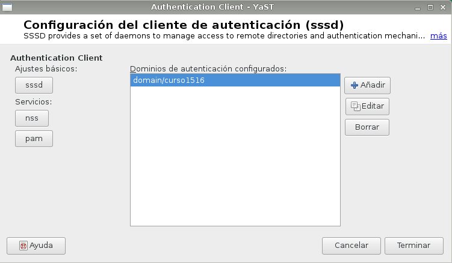

Para crear los usuarios y grupos lo haremos desde Yast, pero debemos definir un filtro para usuarios de LDAP.

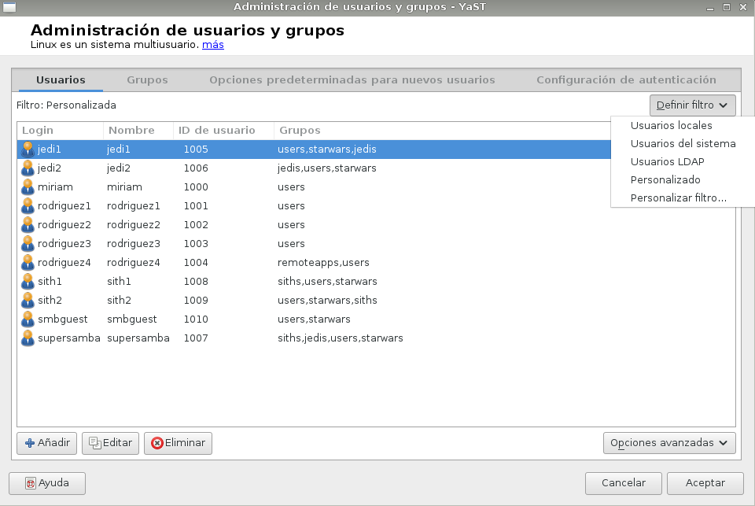

Los creamos:

Creamos también los grupos:

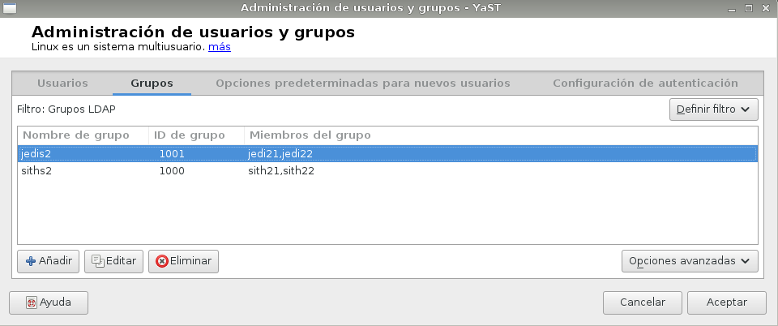

Para visualizar el esquema de lo que hemos configurado, nos descargamos algún browser LDAP, en este caso hemos utilizado 'GQ'.

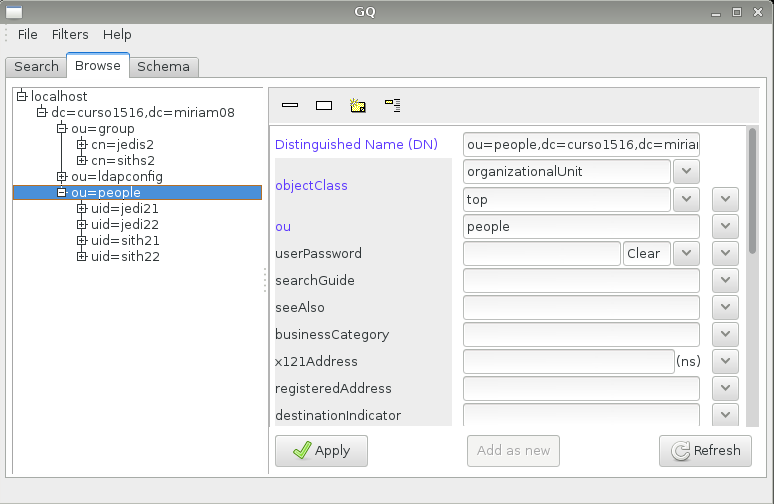

##1.4. Autenticación

Comprobamos que podemos entrar en la MV servidor usando los usuarios anteriormente definidos. Primero, debemos establecer 'ldap_uri' con nuestro dominio:

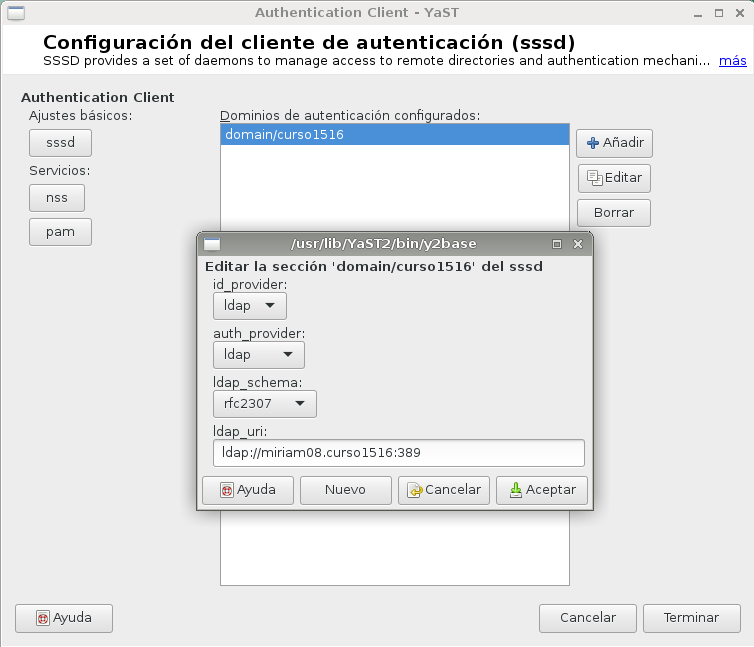

Se puede ver como siendo sudo podemos acceder al usuario sin introducir contraseña:

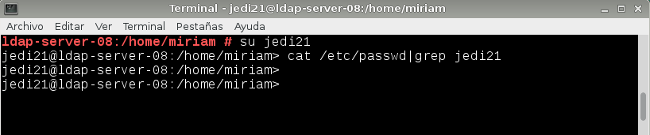

Igual con los otros usuarios:

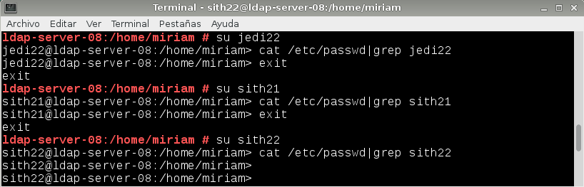

Sin embargo, sin ser sudo no podemos acceder ni introduciendo la contraseña:

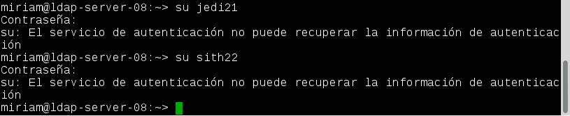

Con el comando 'finger' comprobamos que los home de los usuarios están creados.

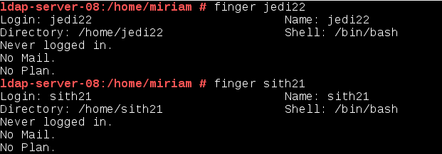

Con los siguientes comandos haremos comprobaciones sobre los usuarios de LDAP.

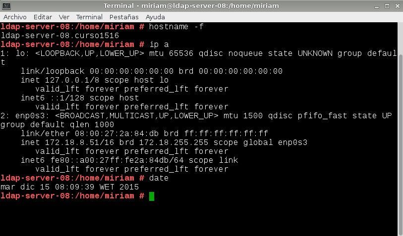

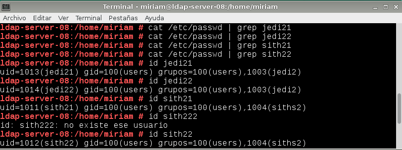

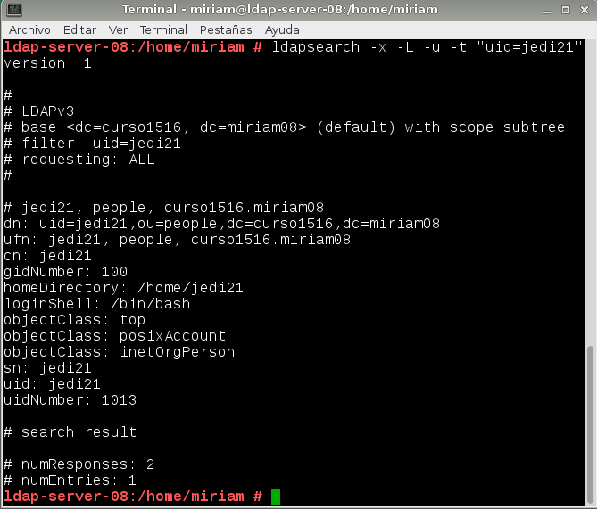

#2. Otro equipo

Ahora que tenemos una máquina con la información cargada en LDAP, vamos a tratar de hacer uso de ella desde una máquina distinta.

##2.1. Preparativos

Aquí dejo captura de las configuraciones realizadas en el slave:

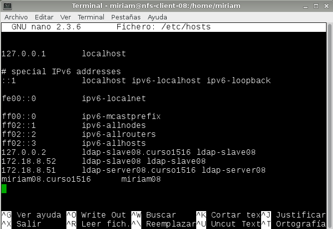

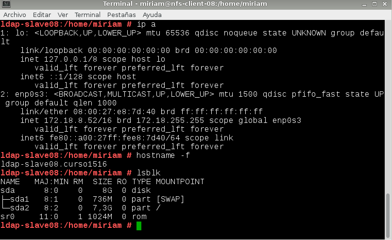

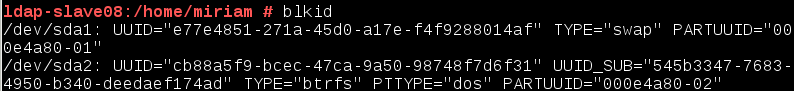

##2.2. Configuración
