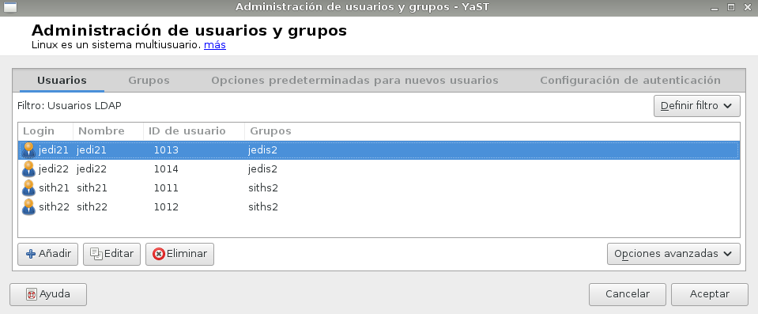

#1. Servidor LDAP - OpenSUSE

En esta práctica vamos a trabajar con LDAP, es un protocolo de tipo cliente-servidor para acceder a un servicio de directorio, esto es, acceder a bases de información de usuarios de una red mediante protocolos TCP/IP. En este caso trabajaremos con distribuciones Linux, concretamente OpenSUSE.

##1.1. Preparativos

Capturar salida de los comandos siguientes en el servidor:

En /etc/hosts añadiremos las siguientes líneas:

##1.2. Instalación del Servidor LDAP

A continuación, vamos a instalar el servidor LDAP, para ello es necesario abrir Yast y buscar un paquete llamado 'yast2-auth-server'. Una vez instalado pasaremos a configurarlo.

Seleccionamos servidor autónomo.

No habilitamos el TLS.

Configuramos la base de datos, dominio, contraseña.

No habilitamos Kerberos, ya que nos dará error más adelante si lo habilitamos.

A continuación, vemos la configuración general ya realizada.

Para comprobar que el servicio está iniciado ejecutamos el comando siguiente:

##1.3. Crear usuarios y grupos en LDAP

Si entramos en 'Authentication client' para introducir nuestro dominio.

Para crear los usuarios y grupos lo haremos desde Yast, pero debemos definir un filtro para usuarios de LDAP.

Los creamos:

Creamos también los grupos:

Para visualizar el esquema de lo que hemos configurado, nos descargamos algún browser LDAP, en este caso hemos utilizado 'GQ'.

##1.4. Autenticación

#2. Otro equipo

##2.1. Preparativos

##2.2. Configuración
