#1. Tareas Programadas

En esta práctica vamos a trabajar con tareas programadas, utilizaremos diferentes herramientas y comandos con los que se puede realizar las mismas acciones. 

#2. SO OpenSUSE

Empezaremos con un sistema operativo Linux, en este caso OpenSUSE. 

##2.1. Configuración

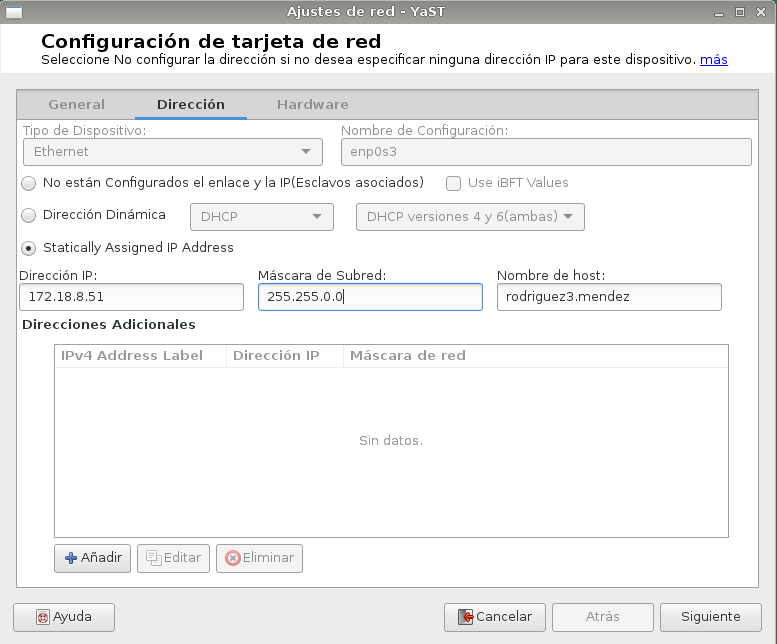

Debemos tener la tarjeta de red en modo puente, además asegurarnos de que el nombre de host está en el fichero /etc/hosts, para que el comando hostname funcione bien como a continuación:

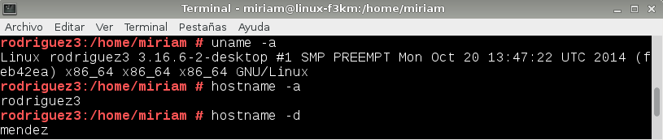

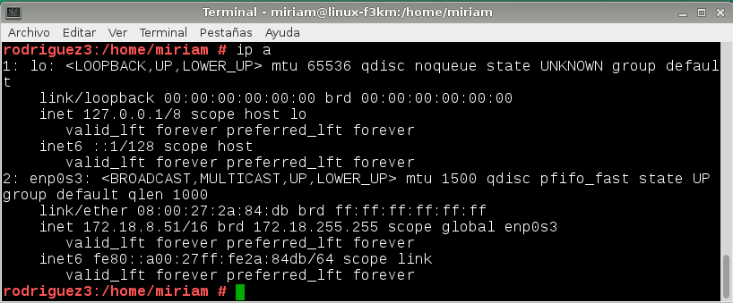

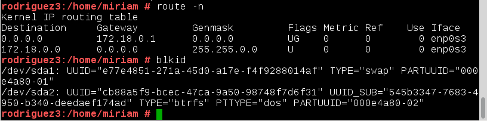

##2.2. Tarea diferida

Vamos a programar una tarea diferida que nos apagará la máquina. Se puede realizar de dos maneras, mediante un script o directamente con comandos por la consola, este primer ejemplo es con script. Primero hacemos el script con la orden que queramos.

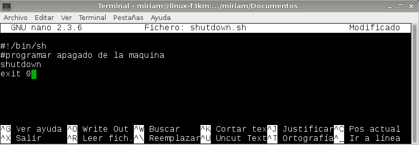

Una vez hecho y guardado, con el comando 'at' lo ejecutamos y elegimos a que hora queremos que se ejecute. El comando 'sudo atd' es para activar el demonio del programa. Vemos como el mismo programa nos avisa de que la acción se realizará a esa hora.

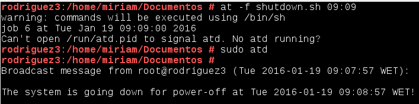

##2.3. Tarea periódica

Ahora programaremos una tarea periódica con 'crontab' para añadir la hora a un fichero. A continuación, podemos ver el script muy sencillo.

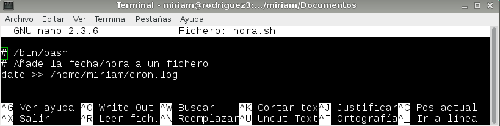

La diferencia entre tarea diferida y periódica está en que la periódica se puede programar para un intervalo de tiempo y la diferida para un momento concreto. Por eso debemos configurar el fichero 'crontab' para especificar todos los parámetros que más nos convengan para realizar la tarea programada, en este caso una vez cada minuto.

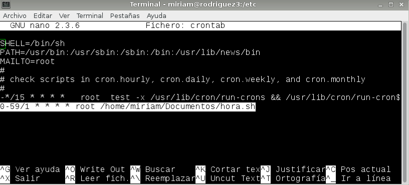

Comprobamos en el fichero especificado como están guardadas todas las horas al empezar el minuto:

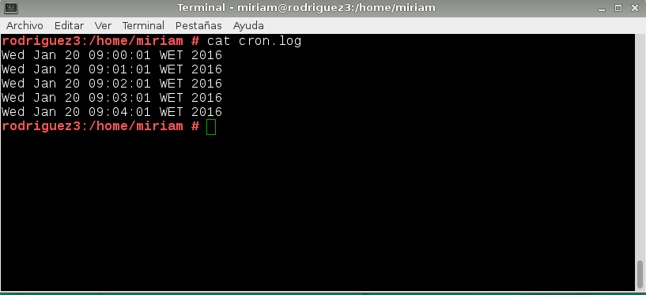

##2.4. Tarea asíncrona

Para terminar, vamos a programar una tarea asíncrona para realizar una copia de backup. Primero debemos realizar el script:

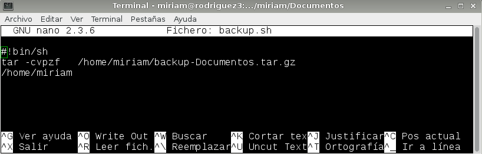

Después deberemos guardar dicho script en cualquiera de estos directorios: cron.hourly, cron.daily, cron.weekly, cron.monthly. Yo he elegido cada hora, por lo tanto guardaré el script en cron.hourly. Esto quiere decir que el script ejecutará una copia de backup cada hora en la ruta especificada.

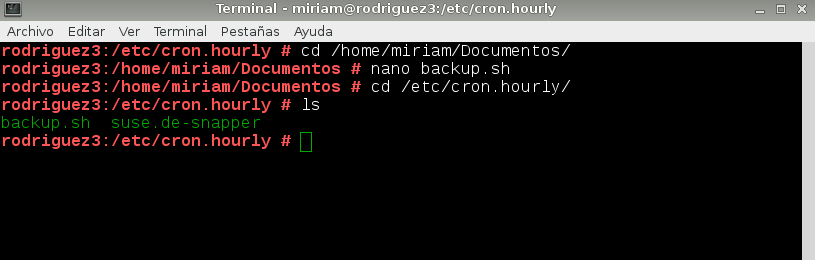

#3. Windows 7

Probaremos lo mismo pero en otro sistema operativo, Windows 7, el cual tiene una herramienta muy cómoda que viene con el sistema llamada 'Programador de tareas' y hace que programar tareas sea un proceso muy sencillo.

##3.1. Configuración

Configuramos la máquina como a continuación, y poner tarjeta de red en modo puente:

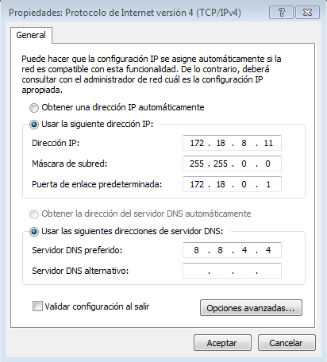

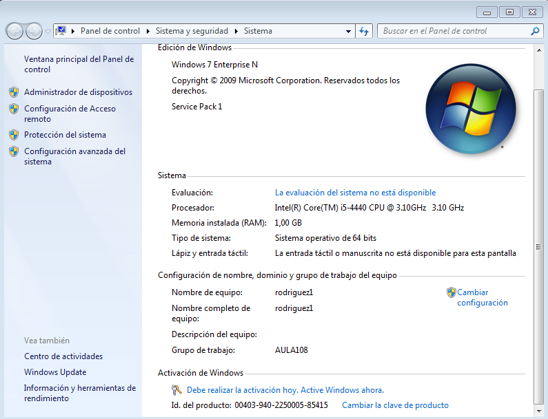

##3.2. Tarea diferida

Crearemos una tarea diferida que apague la máquina a la hora especificada

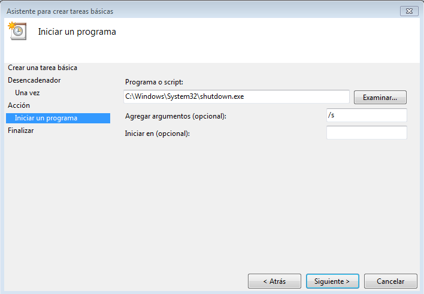

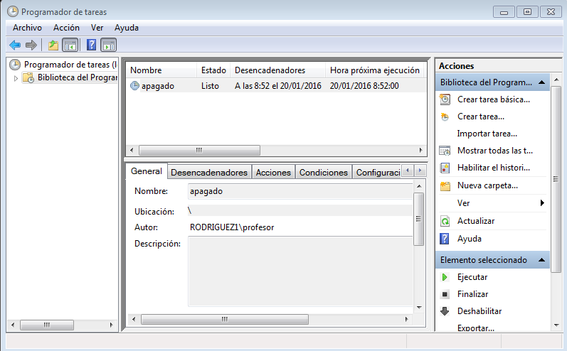

A un minuto de realizarse la tarea, Windows avisa con un mensaje de advertencia:

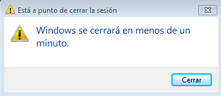

##3.3. Tarea periódica

Vamos a programar una tarea periódica para que salte un mensaje en pantalla. Es el mismo proceso que antes pero seleccionando el momento en el que queremos que ocurra: diariamente, semanalmente.. Y vemos que ha funcionado.

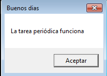

##3.4. Tarea asíncrona

Programaremos una tarea asíncrona para que se abra un programa, en mi caso la consola de comandos. Elegimos diariamente, a las 9.

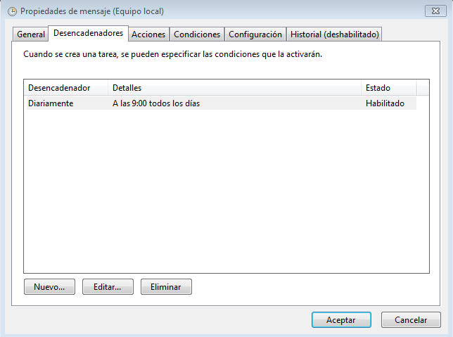

Seleccionamos la ruta del archivo '.exe' de la consola.

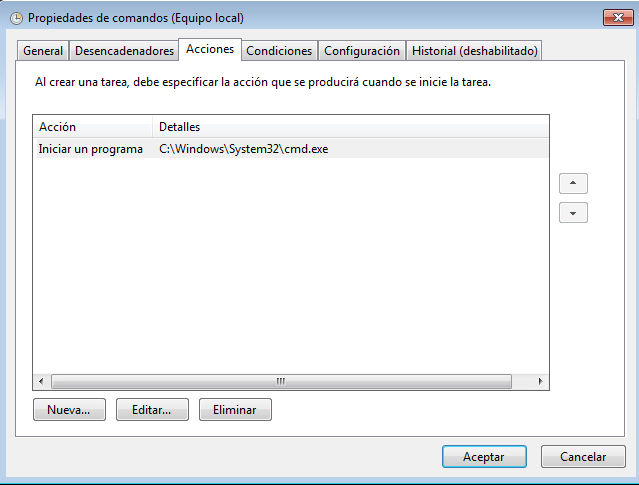

Vemos la tarea programada, junto con las otras anteriores que ya hemos programado:

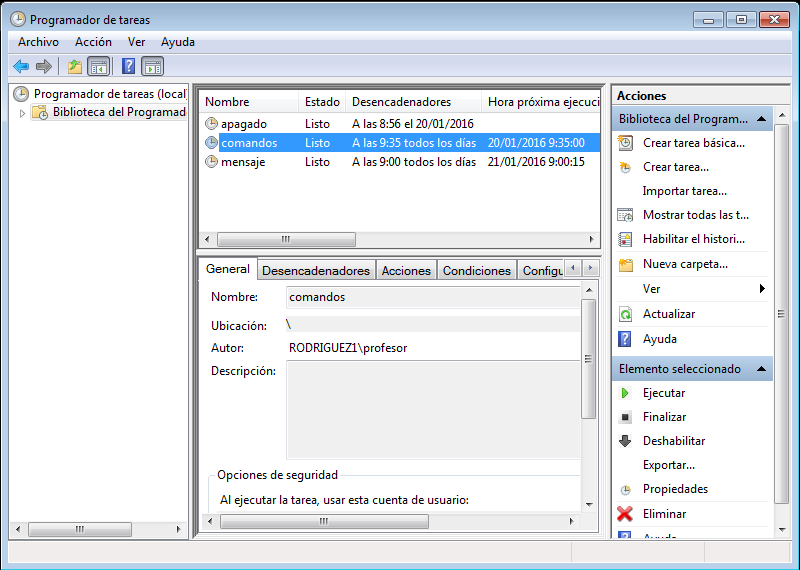

Y efectivamente, a las 9 la consola se abre:

