#1. Introducción

En esta práctica vamos a trabajar con Vagrant, es una herramienta para la creación y configuración de entornos de desarrollo virtualizados.

#2. Primeros pasos

##2.1. Instalar

Para instalar vagrant hay varias formas, nosotros vamos a usar un paquete preparado para descargar del servidor Leela.

##2.2. Proyecto

Creamos un directorio para nuestro proyecto vagrant y ejecutamos el siguiente comando para iniciar la configuración de la máquina:

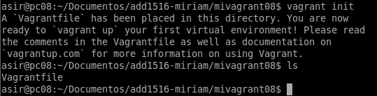

##2.3. Imagen, caja o box

Ahora necesitamos obtener una imagen de un sistema operativo, hemos descargado la nuestra desde la dirección siguiente: 'vagrant box add micajaXX_ubuntu_precise32 http://files.vagrantup.com/precise32.box'.
Podemos listar las cajas disponibles en nuestro sistema con 'vagrant box list'. Para poder usar una caja determinada en nuestro proyecto, modificamos el fichero 'Vagrantfile' de la carpeta del proyecto.

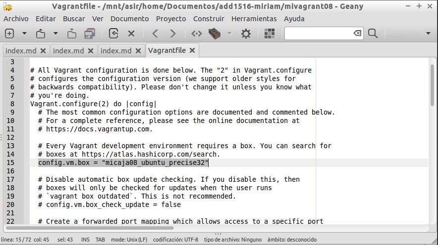

##2.4. Iniciar la máquina

Vamos a iniciar la máquina virtual creada con Vagrant:

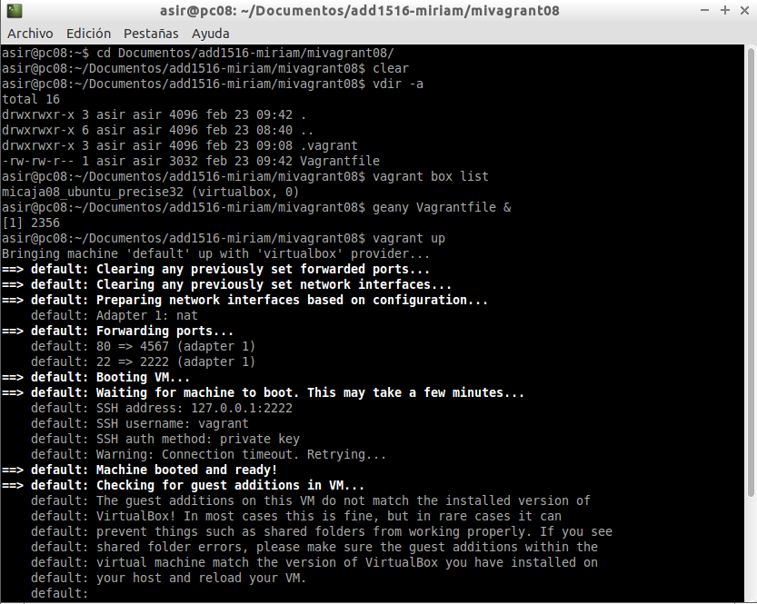

Ejecutando 'vagrant ssh' podemos conectarnos con nuestra máquina virtual:

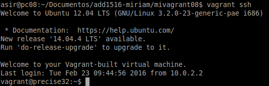

Comprobamos en VirtualBox como la máquina está creada y funcionando:

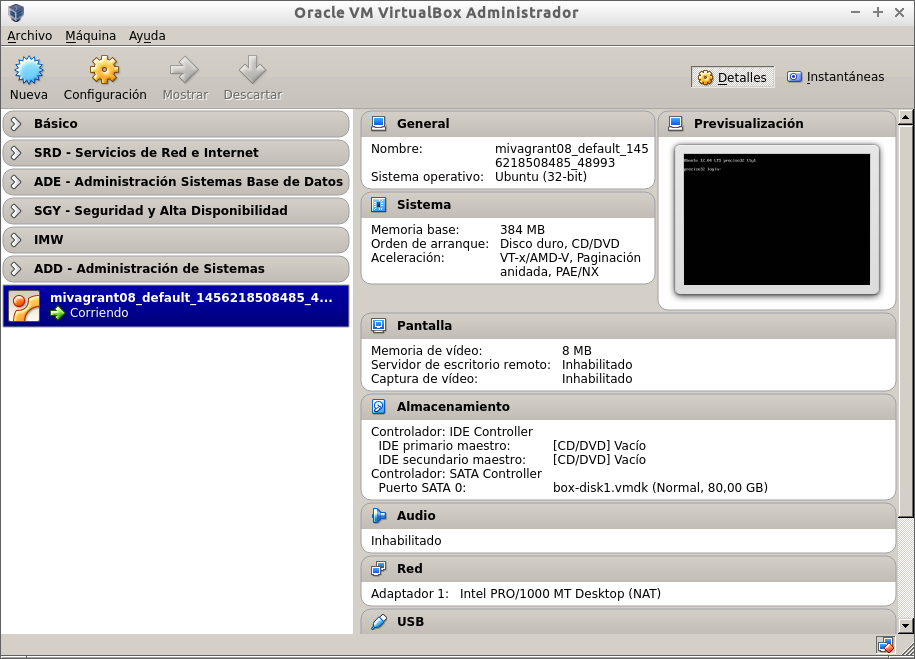

Una vez creada la máquina y funcionando se crea el siguiente directorio:

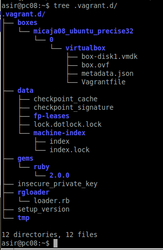

#3. Configuración

##3.1. Carpetas sincronizadas

La carpeta del proyecto que contiene el Vagrantfile comparte los archivos entre el sistema anfitrión y el virtualizado, esto nos permite compartir archivos fácilmente entre los ambientes. Cualquier archivo que coloquemos en este directorio será accesible desde cualquiera de los 2 extremos.

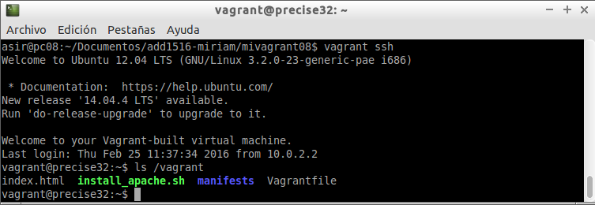

##3.2. Redireccionamiento de los puertos

Uno de los casos más comunes cuando tenemos una máquina virtual es la situación que estamos trabajando con proyectos enfocados a la web, y para acceder a las páginas no es lo más cómodo tener que meternos por terminal al ambiente virtual y llamarlas desde ahí, aquí entra en juego el enrutamiento de puertos.

Modificamos el fichero Vagrantfile, de modo que el puerto 4567 del sistema anfitrión será enrutado al puerto 80 del ambiente virtualizado.

**Más adelante comprobaremos que el redireccionamiento funciona, cuando tengamos instalado el servidor local.**

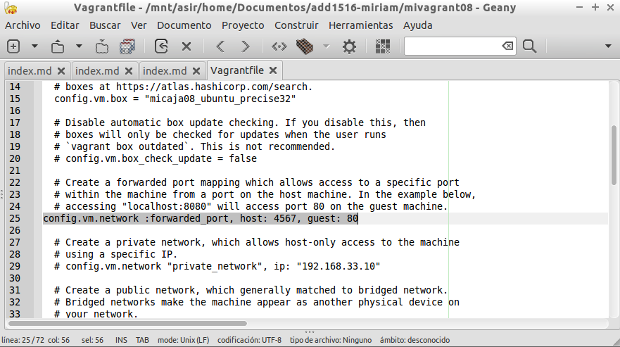

#4. Suministro
 
##4.1. Suministro mediante script

Suministraremos al ambiente virtual con un pequeño script que instale Apache. Creamos el script 'install_apache.sh', dentro del proyecto:

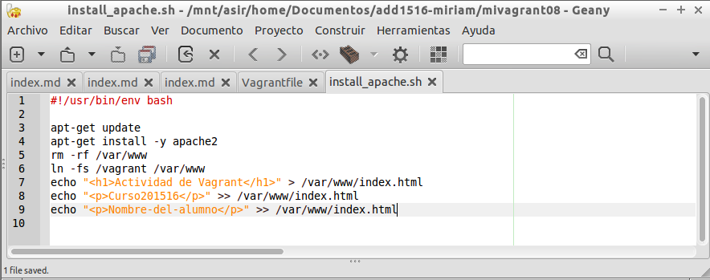

Modificamos el 'Vagrantfile' y agregamos la siguiente línea de configuración:

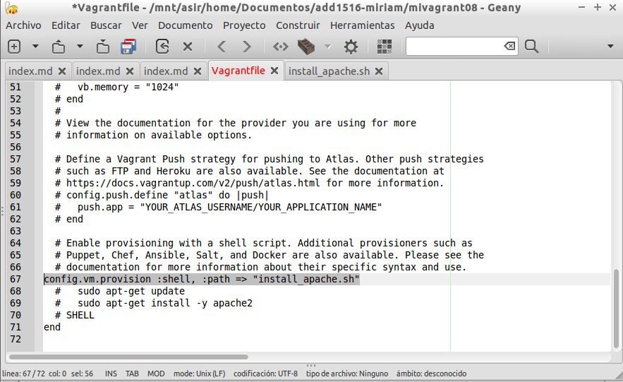

Reiniciamos la máquina si ya está en ejecución 'vagrant reload':

Vemos que no nos ha ejecutado ningún cambio, en las dos últimas líneas de código que se ven, en color blanco, nos indica que si no se han producido los cambios en la configuraicón deberemos ejecutar 'vagrant provision':

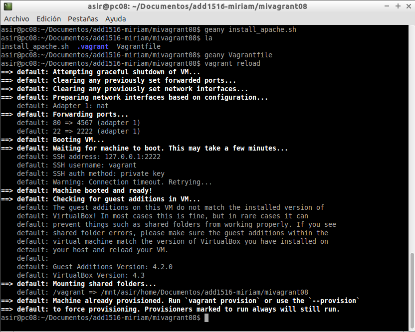

Ejecutamos 'vagrant provision' y observamos como se producen los cambios: apt-get update, ...

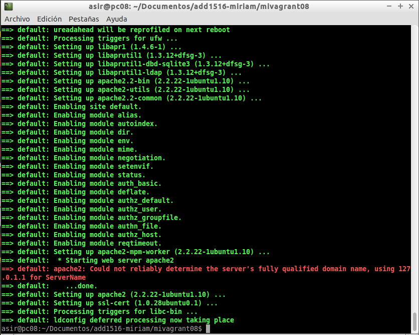

Comprobamos que funciona introduciendo la IP en un navegador de nuestra máquina:

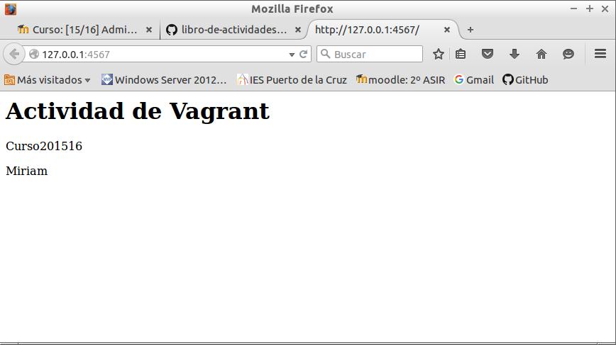

##4.2. Suministro mediante Puppet

Modificamos el fichero 'VagrantFile' y añadimos las siguientes líneas para que use Puppet. Concretamente que utilize el fichero específicado:

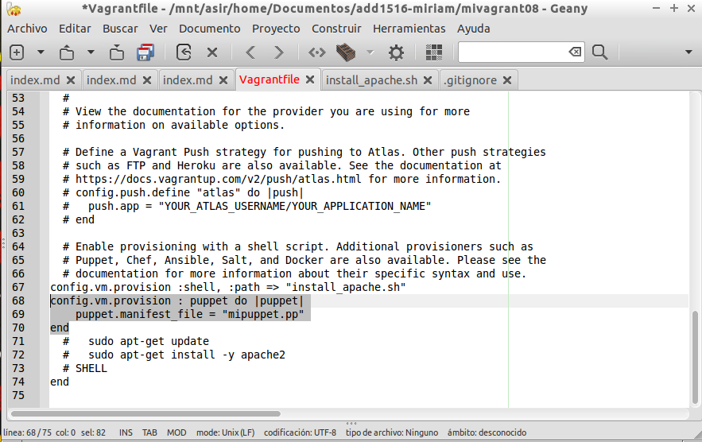

Ahora muestro el fichero de configuración de puppet:

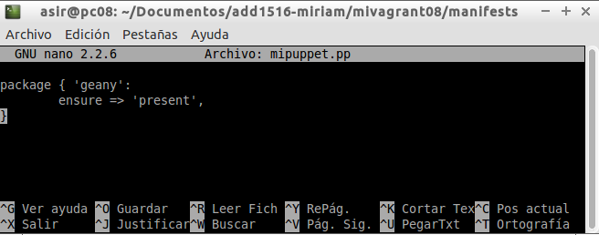

Comprobamos que se ejecuta la acción del puppet cuando reiniciamos la máquina en vagrant:

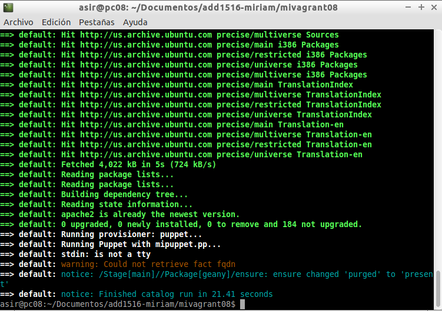

