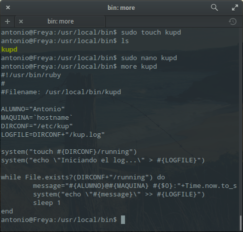
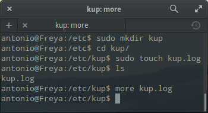
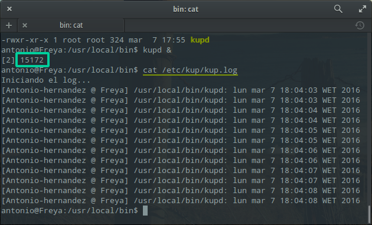

# 1. Procesos

Un programa (estático) es un conjunto de instrucciones y datos que se encuentran almacenados en un
fichero ordinario. Cuando un programa es leído por el sistema operativo y cargado en memoria para
ejecutarse, se convierte en un proceso (dinámico). A los procesos, el sistema operativo les asigna recursos
para que puedan ejecutarse correctamente. Entre estos recursos podemos citar: memoria, CPU,
dispositivos de entrada-salida etc.

Cada proceso en Linux tiene asociado un número que lo identifica. Este número es asignado por el
núcleo, y se denomina identificador de proceso o PID (Process IDdentifier). Además del PID, los
procesos tienen asignado otro número denominado PPID (Parent PID), que identifica al proceso “padre”
del proceso en cuestión. Un proceso “padre” puede tener varios “hijos” pero cada “hijo” sólo tiene un
“padre”.

## 1.1. Procesos en “primer plano” y en “segundo plano”

Un sistema operativo Linux tiene la posibilidad de ejecutar una orden en primer plano (foreground) y
una o más órdenes en segundo plano (background), originando cada una de ellas uno o más procesos.
El procesamiento en “segundo plano” está indicado para comandos que cumplen las siguientes
condiciones:

* Tiempo de ejecución grande. Así se pueden ejecutar inmediatamente otros comandos tanto en “primer
plano” como en “segundo plano”.
* No interactúan con el usuario. No necesiten entradas procedentes del teclado.
* No producen salida en pantalla. O si la producen se redirigen a un fichero (para conservarla) o al
dispositivo nulo (para eliminarla).
* No requieren prioridad alta. El kernel asigna menor prioridad a los procesos en “segundo plano”.
La ejecución de una orden en “segundo plamo” origina una tarea (trabajo).

## 1.2. Comandos para procesos

**top**

El comando top es un clásico para mostrar los recursos usados por tu sistema y así poder ver cual de ellos consume más.

**htop**

Es un “top” mejorado, no suele venir instalado en las distribuciones Linux. Sobre todo es más fácil de interpretar que su hermano top y además puedes realizar operaciones como parar un proceso usando las teclas.

Puedes instalarlo así en caso de no tenerlo en tu sistema:
	
`sudo apt-get install htop`

**ps**

El comando más usado (y universal) para manipular procesos en Linux. Muestra todos los procesos y además puedes realizar operaciones con ellos. Recuerda que puedes enlazarlos con otros comandos (por ejemplo con “grep” para buscar un proceso específico) usando las famosas pipes o tuberías. Ejemplo para buscar procesos de Firefox:
	
ps -A | grep firefox

**pstree**

Visualiza todos los procesos en forma de árbol para mostrar sus dependencias.

**kill**

Comando para matar o parar un proceso, funciona dando su ID.

**pgrep**

Devuelve el ID del proceso que coincide con la búsqueda:
	
pgrep firefox

--imagen--

**pkill & killall**

Estos comandos pueden matar procesos dando el nombre del mismo. 

**renice**

Este comando cambia el valor “nice” de un proceso en ejecución. El valor “nice” determina la prioridad del proceso. Un valor de -19 es de muy alta prioridad, mientras que un valor 19 es de baja prioridad. Por defecto el valor es el 0. Necesita el PID del proceso:
	
renice 19 PID

--imagen--

**xkill**

Si ejecutas este comando desde un terminal en modo gráfico, el cursor cambiará a un símbolo “X” y con él podrás matar cualquier programa gráfico abierto que tengas en tus escritorios (si no quieres  matarlo, haz click con el botón derecho). 

--imagen

**atop**

Monitor de procesos en ASCII en tiempo real donde muestra CPU, memoria, capas de red, usuario, prioridad, etc para cada proceso activo.

# 2. Servicios

Un servicio es un programa que se ejecuta en segundo plano, fuera del control interactivo de los usuarios del sistema ya que carecen de interfaz con estos.

El sistema generalmente inicia los demonios durante el arranque, siendo las funciones más comunes de estos las de ofrecer servicios a otros programas, ya sea respondiendo a las peticiones que llegan a través de la red o atendiendo a procesos que se ejecutan en el mismo sistema, así como responder ante cierta actividad del hardware —por ejemplo acpid maneja el apagado del sistema cuando el usuario pulsa el botón de encendido del equipo—. Algunos demonios sirven para configurar hardware —como es el caso de udevd en algunos sistemas GNU/Linux— ejecutar tareas planificadas —como hace cron— o realizar otras funciones similares.

**init**

El servicio individual más importante en un sistema UNIX es provisto por init. init es el primer proceso que se inicia en todo sistema UNIX, siendo la última acción que el núcleo realiza al arrancar. Cuando init comienza su ejecución, continúa con el proceso de arranque del sistema, realizando varias tareas de inicio (chequear y montar sistemas de archivos, iniciar demonios, etc.). 

*Directorio init.d*

En el directorio /etc/init.d (puede ser /etc/rc.d/init.d) se encuentran los scripts que permiten controlar los servicios y su ejecución. Cada uno de éstos shells aqui existentes aceptan, casi de manera general, los parámetros:

    start
    stop
    restart
    status

Algunos aceptan más, y pocos aceptan menos. Los parámetros suelen ser muy descriptivos (iniciar, detener, reiniciar y estatus del servicio). Así pues, para reiniciar nuestro servidor Apache en Ubuntu bastaría con escribir:

/etc/init.d/apache2 restart

Comando ‘service’

Este comando, presente en la mayoría de distros, nos permite de igual manera interactuar con los servicios instalados en nuestro equipo, su sintaxis:

service servicio param

## Práctica creación de un servicio

